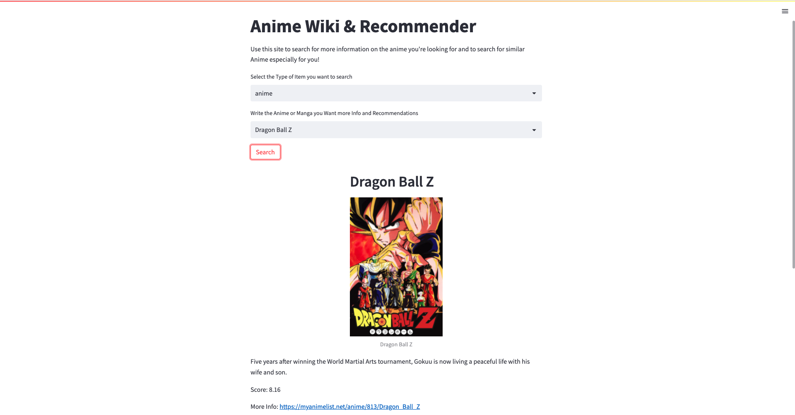

# Anime_recommender

## Example Images




This project is a simple anime recommender system. It uses the [Anime Dataset](https://www.kaggle.com/CooperUnion/anime-recommendations-database) from Kaggle. The dataset contains 12,294 anime and 73,516 user ratings.

The App is divided into two parts. The first part is a FastAPI server (backend) that provides the data and endpoints for the queries. The second part is a Streamlit App that uses the data from the server to provide a simple user interface.

## Installation

Use the package manager pipenv to install the required packages.

```bash
pipenv install
```

## Usage

```bash

# Run the FastAPI server
pipenv run uvicorn main:app --reload

# Run the Streamlit App afterwards
pipenv run streamlit run app.py
```